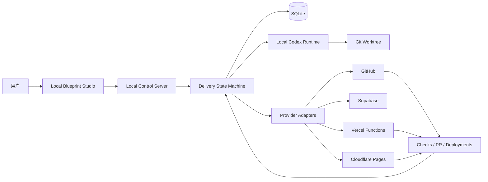
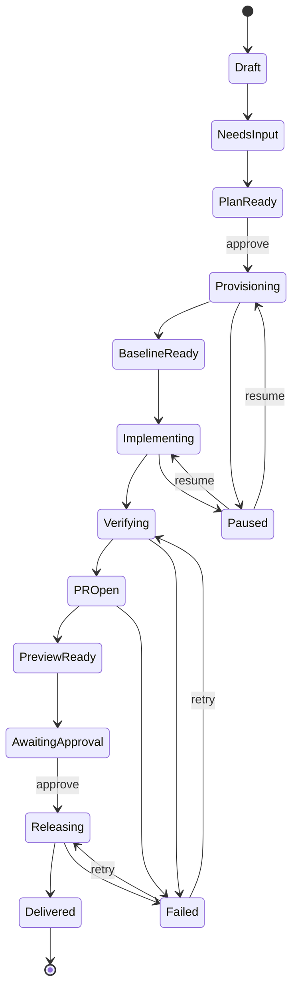

# Agent-Dev v0.1 技术架构

> 状态：Architecture Draft  
> 日期：2026-08-02

## 1. 架构目标

v0.1 使用 Local-first Web App 验证完整交付链。系统在用户电脑运行本地控制服务，并通过浏览器提供 Studio UI；代码、Codex 登录态和主要开发凭据尽量留在本机。

首版不建设多租户 SaaS、托管模型或远程代码执行基础设施，但所有执行能力必须通过 Adapter 隔离，为未来替换本地/云端 Runtime 和 Provider 预留边界。

## 2. 系统上下文



## 3. 核心组件

| 组件 | 职责 | 首版技术建议 |
| --- | --- | --- |
| Studio | 问卷、计划、时间线、环境和报告 | React、Vite、TypeScript |
| Local API | 本地控制面和事件接口 | Hono、Node.js |
| Blueprint Engine | Schema、默认值、覆盖、生成和 Diff | JSON Schema、Zod、模板引擎 |
| Workflow Engine | 状态机、暂停、恢复、重试和 Gate | XState + 持久化适配 |
| Local Store | 项目、运行、步骤、审批、证据 | SQLite + Drizzle |
| Runtime Adapter | 调用 Codex，控制工作区和收集结果 | Node child process，官方非交互接口 |
| Provider Adapter | 对外平台的 discover/plan/apply/verify | 平台官方 API/CLI |
| Evidence Store | 保存测试、PR、部署和人工验收元数据 | SQLite + 本地文件引用 |
| Event Transport | UI 实时进度和日志 | Server-Sent Events |

## 4. 工程结构

```text
agent-dev/
├── apps/
│   ├── studio/
│   ├── daemon/
│   └── cli/
├── packages/
│   ├── blueprint/
│   ├── workflow/
│   ├── policy/
│   ├── agent-runtime/
│   ├── provider-core/
│   ├── provider-github/
│   ├── provider-supabase/
│   ├── provider-vercel/
│   ├── provider-cloudflare/
│   ├── deployment-composer/
│   ├── env-contract/
│   └── evidence/
├── templates/
│   └── web-saas/
└── schemas/
```

使用 npm workspaces，不在首版引入 Nx、Kubernetes、消息队列或微服务。包边界服务于契约和测试，不要求独立部署。

## 5. 数据模型

首版至少包含：

- `projects`：本地目录、仓库、当前 Blueprint 版本；
- `blueprint_revisions`：完整结构化规范、来源和状态；
- `integrations`：Provider 类型、资源 ID、授权状态和能力；
- `environments`：preview、dev、production 及其资源映射；
- `delivery_runs`：初始化或功能交付运行；
- `step_runs`：步骤状态、输入摘要、输出摘要、重试和错误；
- `approvals`：Gate 类型、请求、决定和决定人；
- `evidence`：外部系统、URL、run ID、结果、时间和校验摘要；
- `secret_references`：Secret 的存储位置、目标和版本，不保存明文；
- `manual_actions`：必须由用户完成的动作和验证状态。

数据库只保存事实和引用。大日志、截图、构建产物保存为本地文件或外部 Artifact，并记录内容哈希。

## 6. Delivery State Machine



每个 Step 必须具备：稳定 ID、输入版本、幂等键、前置条件、超时、输出 Schema、验证器、风险级别、重试策略和可选补偿动作。

自动修复最多两次。两次失败后创建人工 Gate，输出失败分类、受影响验收标准、已尝试方案和推荐选择。

## 7. Agent Runtime

首版只实现 `LocalCodexRuntime`，不将 Codex 本身作为不可替换依赖。后续通过 Agent Runtime Catalog 注册内置和自定义 Adapter：

```ts
interface AgentRuntime {
  detect(): Promise<RuntimeStatus>;
  capabilities(): Promise<RuntimeCapabilities>;
  start(task: DeliveryTask): Promise<AgentSession>;
  resume(sessionId: string, decision: HumanDecision): Promise<void>;
  cancel(sessionId: string): Promise<void>;
  collectEvidence(sessionId: string): Promise<Evidence[]>;
}
```

Runtime Catalog 负责保存 Agent ID、来源（`built-in`/`custom`）、本地命令、版本探测、能力 Probe 和适配器版本。用户在新手模式只输入名称和启动命令，Daemon 自动生成并校验内部配置；专业模式才显示命令模板、输出解析和取消/恢复策略。

运行约束：

- 使用独立 Git worktree 和 feature 分支；
- 只传入已批准规格、验收标准、Policy 和必要仓库上下文；
- 不把生产 Secret 注入 Agent 上下文；
- 不解析或窃取 Codex 的登录 Token；
- 不调用私有或未稳定接口；
- 不允许 Agent 绕过 GitHub Rulesets、环境审批或质量门禁；
- Agent 输出是候选结论，必须由确定性验证器确认。

OpenAI 官方 Codex 手册和页面在 2026-08-02 的核对请求中返回 `403`，因此具体非交互命令和输出协议必须在实现前单独 Spike，不在本设计中假定。

## 8. Provider Adapter

所有平台实现统一契约：

```ts
interface ProviderAdapter<TSpec, TPlan, TState> {
  discover(context: ProviderContext): Promise<TState>;
  plan(spec: TSpec, current: TState): Promise<TPlan>;
  apply(plan: TPlan, approval: Approval): Promise<ApplyResult>;
  verify(expected: TSpec): Promise<VerificationResult>;
  detectDrift(expected: TSpec): Promise<Drift[]>;
}
```

`plan` 必须无副作用；`apply` 只能执行经过批准的 Plan；`verify` 必须从供应商重新读取真实状态，不能复用 `apply` 的乐观返回值。

## 9. 联合部署拓扑

```text
Browser
  -> Cloudflare Pages: React/Vite static frontend
  -> Vercel Functions: Hono API
  -> Supabase: Database/Auth/Storage
```

生产建议使用：

```text
https://app.example.com 或 https://example.com -> Cloudflare Pages
https://api.example.com                       -> Vercel
```

### PR Preview 顺序

1. 运行 quality；
2. 部署 Hono API 到 Vercel Preview；
3. 获取并验证 API URL；
4. 将 API URL 作为 `VITE_API_BASE_URL` 构建前端；
5. 部署前端到 Cloudflare Pages Preview；
6. 更新 Vercel API 的精确 CORS 允许来源；
7. 更新必要的 Supabase Auth Redirect URL；
8. 运行 API 健康检查和前后端联合冒烟测试；
9. 将两个 URL 和证据回填 PR。

两个部署不能无约束并发。API 未验证时不得发布引用该 API 的前端；页面部署失败时运行保持未完成，不能把 API 成功等同于交付成功。

### dev 与 production

- feature PR 使用临时联合 Preview；
- `dev` 使用稳定的页面/API 环境进行集成验收；
- `main` 对应 production，并要求人工批准；
- production 从生产分支的一份独立 checkout 发布，且该分支必须已带上被人工验收的提交；不允许从实现功能的本地 workspace 直接发布，否则线上版本无法从生产分支复现；
- production 发布 API 在前、页面在后；
- 页面发布完成后运行完整生产冒烟测试。

## 10. GitHub 工作流

```text
feature/* -> dev PR
  quality -> deploy-api-preview -> deploy-web-preview -> smoke
  -> human preview approval -> merge

dev -> main PR
  release-quality -> production approval
  -> deploy-api -> verify-api -> deploy-web -> verify-production
```

部署步骤应通过同一编排 workflow 或受控 reusable workflows 建立明确 `needs` 依赖。不要让 CI workflow 修改代码、移动分支或无限重试部署。

## 11. 安全模型

- 本地 API 默认只监听 loopback，并使用会话级防伪 Token；
- Provider 凭据优先复用官方 CLI/OAuth 登录，额外凭据进入系统 Keychain；
- SQLite 只保存 Secret Reference 和状态摘要；
- UI、日志、Evidence 和 Markdown 对 Secret 做结构化脱敏；
- Preview 与 production 使用不同环境和凭据；
- Cloudflare Pages 只接收明确标记为 public 的前端变量；
- Vercel API 才可接收 Supabase Service Role 等服务端 Secret；
- 生产、DNS、权限扩大、数据迁移和付费资源必须人工 Gate；
- 所有外部写操作记录请求 ID、计划版本、批准记录和验证结果。

## 12. 技术 Spike

正式搭建工程前必须完成：

1. **Codex Runtime Spike**：确认官方非交互入口、结构化输出、取消和恢复能力；
2. **Dual Preview Spike**：验证 Vercel API URL 注入 Cloudflare Pages Preview、CORS 和 PR 回填；
3. **Supabase Auth Spike**：验证临时 Pages 域名的 Redirect URL 策略和清理；
4. **Secret Boundary Spike**：确认官方 CLI 登录态、系统 Keychain 和 CI Secrets 的最小复制路径；
5. **Workflow Resume Spike**：进程中断后从 SQLite 恢复一个等待人工批准的运行。

Spike 失败时优先缩小 v0.1 自动化范围，并生成 Manual Action；不允许通过请求更大权限掩盖能力缺口。
